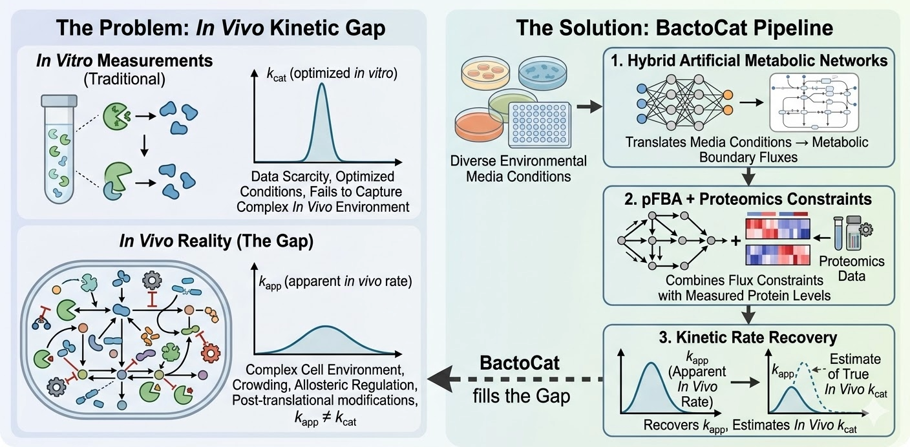

# 🦠 BactoCat 

A computational framework to bridge the gap between *in vitro* and *in vivo* enzyme kinetics. 

By integrating large-scale condition-phenotype datasets, machine-learning-derived boundary fluxes, and quantitative proteomics into Genome-Scale Metabolic Models (GEMs), BactoCat calculates apparent catalytic rates ($k_{app}$) that reflect the true catalytic capacities of bacterial enzymes.

## Navigation

* [The *In Vivo* Kinetic Gap](#the-in-vivo-kinetic-gap)
* [Getting Started](#getting-started)
* [Basic usage](#basic-usage)
* [Repository Structure](#repository-structure)

## The *In Vivo* Kinetic Gap

<div align="center">
  <figure>
    
    <figcaption><i>BactoCat Pipeline (generated with Nano Banana 2)</i></figcaption>
  </figure>
</div>

- Modern metabolic engineering and systems biology face a massive kinetic data scarcity. 
   - Existing databases capture *in vitro* turnover rates for only a small fraction known metabolic reactions. 
   - These optimized test-tube measurements frequently fail to represent the complex and constrained environments of living cells.
- BactoCat overcomes this by working backward from whole-cell phenotypes: 
   - The pipeline translates diverse environmental media conditions into metabolic boundary fluxes using hybrid Artificial Metabolic Networks. 
   - It then combines these data-driven constraints with proteomics and Parsimonious Flux Balance Analysis (pFBA), to recover the apparent catalytic rates ($k_{app}$), and finally an estimate of the *in vivo* $k_{cat}$.

## Getting Started

1. Clone the repository:
   ```bash
   git clone https://github.com/lyach/BactoCat.git
   ```

2. Navigate to the project directory:
   ```bash
   cd BactoCat
   ```

3. Create an isolated virtual environment:
   
   **Using `uv` (recommended)**
    ```bash
    # Install uv (if first time)
   curl -LsSf https://astral.sh/uv/install.sh | sh # Linux/macOS
   # or
   pip install uv # Windows

   # Create environment
   uv venv --python 3.10 .venv

   # Activate environment
   source .venv/bin/activate # Linux/macOS
   # or 
   .venv\Scripts\activate # Windows

   # Install dependencies
   uv sync
   ```

   **Using `conda`**
    ```bash
    # Create environment
   conda create -n bactocat python=3.10

   # Activate environment
   conda activate bactocat

   # Install dependencies
   pip install -e .
   ```


## Basic Usage

After set-up, you can run the main pipeline  with:
```bash
python scripts/run_kapp_pipeline configs/run_kapp_pipeline/ecoli_medium_aidaying.yaml
```

You can also run a detailed verbose output with `v`:
```bash
python scripts/run_kapp_pipeline -v configs/run_kapp_pipeline/ecoli_medium_aidaying.yaml
```

A full documentation of the pipeline parameters, inputs and outputs can be found [here](docs/kapp_pipeline.md).


## Repository Structure

```

├── configs            <- Configuration files for automated runs
│
├── data
│   ├── external       <- Data from external pipelines
│   ├── interim        <- Intermediate data
│   ├── processed      <- Canonical data ready for modeling
│   └── raw            <- Original data
│
├── docs               <- Extended documentation
│
├── results            <- Store pipeline outputs
│
├── scripts            <- Run pipeline & analyses
│
└── src                           <- Source code for BactoCat
    │
    ├── __init__.py               <- Makes a Python module
    │
    ├── config.py                 <- Stores variables 
    │
    ├── enzyme_classifier.py      <- Functions for enzyme classification using GEM GPR rules
    │
    ├── gene_sequence_maper.py    <- Functions to recover protein sequences via UniProt
    │
    ├── kap_builder.py            <- Functions to build kapp and kmax datasets
    │
    ├── paxdb_mapper.py           <- Functions to map gene IDs to PaxDB proteomics data
    │
    ├── plots.py                  <- Functions to create visualizations
    │
    ├── substrate_mapper.py       <- Functions to recover enzyme substrates from GEM reactions
    │ 
    └── utils.py                  <- Utilities

```

## Project Status

**BactoCat** is a project under active development. The current release successfully implements the core pipeline mapping environmental conditions to apparent catalytic rates ($k_{app}$) via standard AMN and pFBA integration. Upcoming features include the Artificial Metabolic Network module.